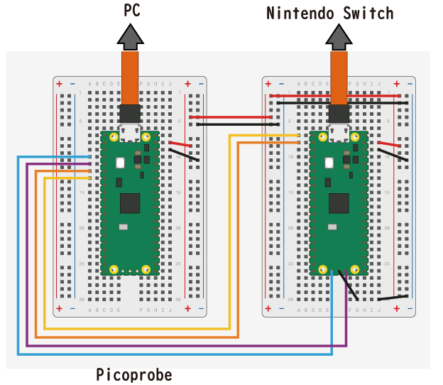

# PROCTRL001

Raspberry Pi PicoをSwitchにコントローラーとして認識させ、外部のPC等から制御させるFirmwareとなります。
Raspberry Pi Pico 2枚とPCを組み合わせて使用します。

## 配線

左側のRaspberry Pi PicoはPicoprobeを書込、USB-UART変換として使用します。右側のRaspberry Pi Picoは本Firmware書込、使用します。

## 使用例

PC(windows)と組み合わせて使用するプログラム例はこちらで公開しています。

[https://github.com/hiyuna36/nst_202210](https://github.com/hiyuna36/nst_202210)

## 参考

[1]
Switch Control Library
https://github.com/celclow/SwitchControlLibrary

